# Team Plan — Day 13 Observability

Kế hoạch nhóm 5 người, căn theo `CHECKPOINTS.md`, `RUBRIC.md`, `SUBMISSION.md` và cấu trúc repo.

## Phân vai

| Vai | Thành viên | MSSV | Phạm vi chính |
|---|---|---|---|
| **A — API & Middleware** | Lê Thị Yến Nhi | 2A202601031 | Correlation ID, enrich log context |
| **B — Security (PII)** | Nguyễn Văn Phong | 2A202601241 | PII patterns + scrubber + verify log |
| **C — Metrics & Dashboard** | Nguyễn Thanh Phúc | 2A202601345 | 6 panel + `error_rate_pct` + dashboard evidence |
| **D — SRE & Alerts** | Vũ Huy Hoàng | 2A202601057 | SLO + 3 alert rules + runbook |
| **E — QA & Lead điều tra** | Phạm Khánh Linh | 2A202601507 | Load test, prompt/trace, CP3, `REPORT.md` |

## Timeline 4 giờ (bám CHECKPOINTS)

| Mốc | Thời gian | Việc |
|---|---|---|
| CP0 | 0:00–0:30 | Setup, API chạy, load test baseline, `validate_logs.py` / `validate_dashboard.py` |
| CP1 | 0:30–1:30 | Logging, correlation ID, PII scrub → `validate_logs.py` ≥ 80/100 |
| CP2 | 1:30–2:30 | Traces, prompt v1/v2, dashboard 6 panel, SLO + alerts + runbook |
| CP3 | 2:30–3:30 | Challenge chính thức (sau khi Lab Coach release `config/challenge.json`) |
| Hoàn tất | 3:30–4:00 | `REPORT.md`, evidence, demo Metrics → Traces → Logs |

```mermaid
gantt
    title Day13 Observability — kế hoạch nhóm
    dateFormat HH:mm
    axisFormat %H:%M
    section Chung
    CP0 Setup + baseline           :a0, 00:00, 30m
    section CP1 Logging
    A Middleware + correlation ID  :a1, 00:30, 45m
    B PII scrub + validate         :a2, 00:45, 45m
    Sync validate_logs >= 80       :a3, 01:15, 15m
    section CP2 Observability
    E Traces + prompt v1/v2        :a4, 01:30, 60m
    C Dashboard 6 panel            :a5, 01:30, 60m
    D SLO + alerts + runbook       :a6, 01:30, 60m
    section CP3 + nộp
    Challenge chính thức           :a7, 02:30, 60m
    REPORT + evidence + demo       :a8, 03:30, 30m
```



## Việc từng người (file + đầu ra)

### A — Yến Nhi: Middleware & log context

**File:** `app/middleware.py`, `app/main.py`

**Làm:**
1. Clear `contextvars` mỗi request (tránh leak giữa request).
2. Lấy/tạo `x-request-id` → bind vào structlog.
3. Gắn correlation ID + processing time vào response header.
4. Enrich log: `user_id_hash`, `session_id`, `feature`, `model`, `env` trước `request_received`.
5. (Mở rộng) exception handler thống nhất nếu còn thời gian.

**Done khi:** mọi request có correlation ID xuyên suốt; log có đủ metadata.

**Evidence:** screenshot/log JSON có correlation ID → `submission/evidence/`.

---

### B — Văn Phong: PII scrubbing

**File:** `app/pii.py`, `app/logging_config.py`

**Làm:**
1. Thêm regex: email, phone, card (+ mở rộng passport/địa chỉ VN nếu cần).
2. Đăng ký PII processor **trước** khi JSON render ra file.
3. Chạy `python scripts/validate_logs.py` — mục tiêu **≥ 80/100**.
4. Tự kiểm: gửi request có email/SĐT/thẻ mẫu → không còn plaintext trong `data/logs.jsonl`.

**Phụ thuộc:** A xong middleware trước (hoặc làm song song, sync lúc 1:15).

**Evidence:** log trước/sau redact; điểm `validate_logs.py`.

---

### C — Thanh Phúc: Metrics & Dashboard

**File:** `docs/dashboard-spec.md`, `config/dashboard.yaml` (đọc contract), dashboard runtime (Streamlit/notebook/Grafana…)

**Làm:**
1. 6 panel từ `data/logs.jsonl` theo contract:
   - Latency P50/P95/P99
   - Traffic
   - Error rate + breakdown (`error_rate_pct`)
   - Cost
   - Tokens in/out
   - Quality proxy
2. Time range 1h, threshold/SLO line, đơn vị rõ.
3. `python scripts/validate_dashboard.py` → **`HỢP LỆ: 6/6 panel`**.
4. Practice: `inject_incident.py --scenario rag_slow` → xác nhận P95 tăng.

**Evidence:** ảnh 6 panel + output validator.

---

### D — Huy Hoàng: SLO, Alerts, Runbook

**File:** `config/slo.yaml`, `config/alert_rules.yaml`, `docs/alerts.md`

**Làm:**
1. Điều chỉnh SLO hợp lý (latency P95, error rate, cost, quality) — ghi lý do trong report.
2. Điền **3 alert** symptom-based (không gắn tên class nội bộ).
3. Viết đủ 3 runbook trong `docs/alerts.md` (ba bước kiểm tra, mitigation, owner).

**Gợi ý 3 alert khớp SLI có sẵn:**
- High latency P95
- High error rate
- Cost / quality breach

**Evidence:** YAML + runbook hoàn chỉnh; dẫn path trong `REPORT.md`.

---

### E — Khánh Linh: QA, Trace/Prompt, Challenge, Report

**File:** Langfuse prompts, `scripts/load_test.py`, `submission/REPORT.md`, `submission/evidence/`

**Làm:**
1. **CP0:** setup env, Langfuse keys, baseline validate.
2. Load test tạo data cho A/B/C.
3. **CP2:** ≥10 traces có metadata; prompt `day13-chat` v1/v2 + label/rollback theo `docs/PROMPT_VERSIONING.md`.
4. (Mở rộng) bọc span RAG/LLM nếu còn thời gian.
5. **CP3:** sau khi có `config/challenge.json` (không tự tạo/sửa):

```bash
python scripts/inject_incident.py
python scripts/load_test.py --challenge --concurrency 5
```

Điều tra **Metrics → Traces → Logs**; ghi root cause + fix + preventive.

6. Tổng hợp `REPORT.md`, checklist evidence, demo cuối.

## Điểm sync bắt buộc

| Thời điểm | Ai | Việc |
|---|---|---|
| **0:00** | Cả nhóm | Setup chung 1 máy/API; giữ `.env` local (không commit) |
| **1:15** | A + B | `validate_logs.py` ≥ 80; bàn giao log sạch cho C |
| **2:15** | C + D + E | Dashboard 6/6 + SLO/alert draft + ≥10 traces |
| **2:30** | E dẫn | Challenge chính thức — cả nhóm ngồi cùng điều tra |
| **3:40** | E + tất cả | Điền mục “Đóng góp cá nhân” + commit SHA từng người |
| **3:50** | E / repo owner | `pytest`, `validate_logs`, `git status` — không lộ secret/PII |

## Mapping 5 người ↔ 4 vai README

| Vai README (4) | Ai cover |
|---|---|
| Logging & PII | A + B |
| Tracing & Prompt Version | E |
| Dashboard, SLO & Alert | C + D |
| Incident, Report & Demo | E (+ cả nhóm hỗ trợ CP3) |

Mỗi người vẫn phải giải thích được phần mình khi chấm điểm cá nhân (40đ).

## Checklist evidence (owner)

| Evidence | Owner |
|---|---|
| `validate_logs.py` ≥ 80 | B (Phong) |
| Log có correlation ID | A (Yến Nhi) |
| PII đã redact | B (Phong) |
| ≥10 traces + waterfall | E (Linh) |
| Prompt v1/v2 + rollback | E (Linh) |
| `validate_dashboard.py` 6/6 + ảnh dashboard | C (Phúc) |
| SLO + 3 alerts + runbook | D (Hoàng) |
| Challenge: metric + trace ID + log line | E (Linh) (+ hỗ trợ) |
| `REPORT.md` đầy đủ | E (Linh) tổng hợp; mỗi người tự điền dòng đóng góp |

## Quy ước làm việc

1. **Branch theo vai** (gợi ý): `feat/a-middleware`, `feat/b-pii`, `feat/c-dashboard`, `feat/d-slo-alerts`, `feat/e-report` — merge sớm, tránh đụng file chung.
2. **Không** tự tạo/sửa `config/challenge.json`.
3. **Không** commit `.env`, key, log còn PII.
4. Mọi kết luận incident phải có **trace ID / log line / metric** cụ thể.
5. Demo cuối 2–3 phút: Metrics → Traces → Logs → Root cause (Linh dẫn, mỗi người 20–30s phần mình).

## Thứ tự ưu tiên nếu thiếu giờ

1. CP1 logging + PII (`validate_logs` ≥ 80)
2. Dashboard 6/6 + traces tối thiểu
3. SLO + 3 alerts/runbook
4. Prompt versioning + rollback
5. Challenge + REPORT
6. Phần mở rộng (exception handler, span RAG/LLM)

## Tài liệu liên quan

- [CHECKPOINTS.md](CHECKPOINTS.md)
- [RULES.md](RULES.md)
- [SUBMISSION.md](SUBMISSION.md)
- [RUBRIC.md](RUBRIC.md)
- [SETUP.md](SETUP.md)
- [docs/GUIDE.md](docs/GUIDE.md)
- [docs/PROMPT_VERSIONING.md](docs/PROMPT_VERSIONING.md)
- [docs/DASHBOARD_SETUP.md](docs/DASHBOARD_SETUP.md)
- [docs/grading-evidence.md](docs/grading-evidence.md)
